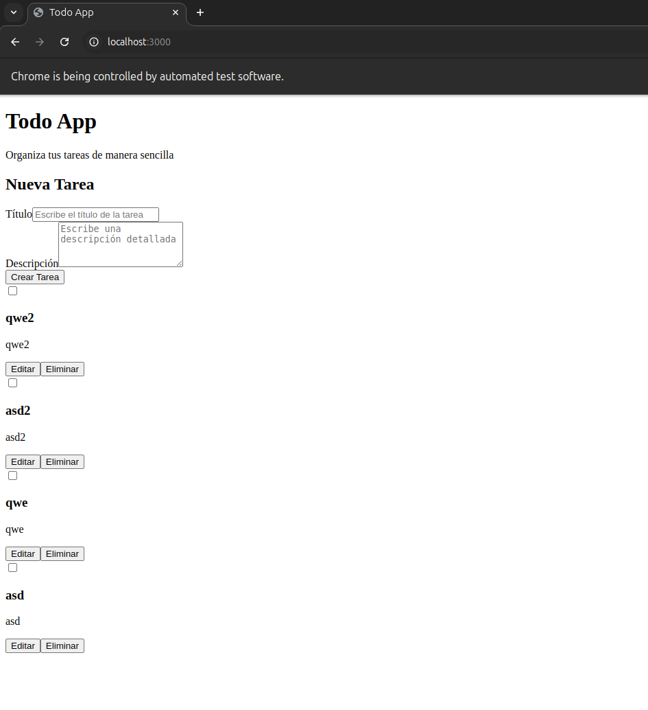

# Todo App

Una aplicación de gestión de tareas construida con Next.js para el frontend y Express.js para el backend.

## Características

- Crear nuevas tareas
- Ver lista de tareas
- Marcar tareas como completadas
- Editar tareas existentes
- Eliminar tareas
- Interfaz de usuario moderna y responsiva



## Tecnologías utilizadas

### Frontend
- Next.js 14
- React 18
- TypeScript
- Tailwind CSS

### Backend
- Node.js
- Express.js
- SQLite3
- CORS

## Requisitos previos

- Node.js (versión 18 o superior)
- npm o yarn

## Instalación

1. Clona el repositorio:
```bash
git clone [URL_DEL_REPOSITORIO]
cd todo-app
```

2. Instala las dependencias del backend:
```bash
cd backend
npm install
```

3. Instala las dependencias del frontend:
```bash
cd ../frontend
npm install
```

## Configuración

1. En el backend, crea un archivo `.env` con la siguiente variable:
```
PORT=3000
```

2. En el frontend, crea un archivo `.env.local` con la siguiente variable:
```
NEXT_PUBLIC_API_URL=http://localhost:3000
```

## Ejecución

### Modo desarrollo

1. Inicia el backend:
```bash
cd backend
npm start
```

2. En otra terminal, inicia el frontend:
```bash
cd frontend
npm run dev
```

La aplicación estará disponible en `http://localhost:3001`

### Construcción para producción

1. Construye el frontend:
```bash
cd frontend
npm run build
```

2. Inicia el servidor de producción del frontend:
```bash
npm start
```

## Estructura del proyecto

```
todo-app/
├── backend/           # Servidor Express.js
├── frontend/          # Aplicación Next.js
│   ├── src/          # Código fuente
│   │   ├── app/      # Páginas de Next.js
│   │   └── components/ # Componentes reutilizables
└── package.json      # Dependencias del proyecto root
```

## Contribución

1. Crea una rama para tu feature:
```bash
git checkout -b feature/nombre-de-la-feature
```

2. Commit tus cambios:
```bash
git commit -m 'Agrega: descripción de los cambios'
```

3. Push a la rama:
```bash
git push origin feature/nombre-de-la-feature
```
